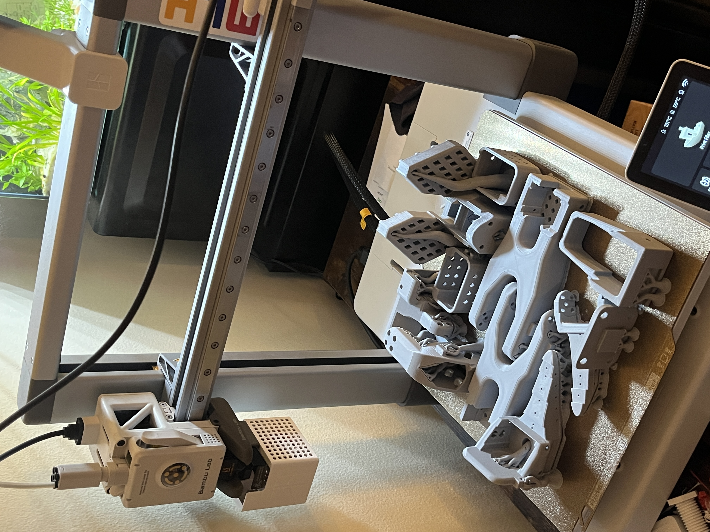
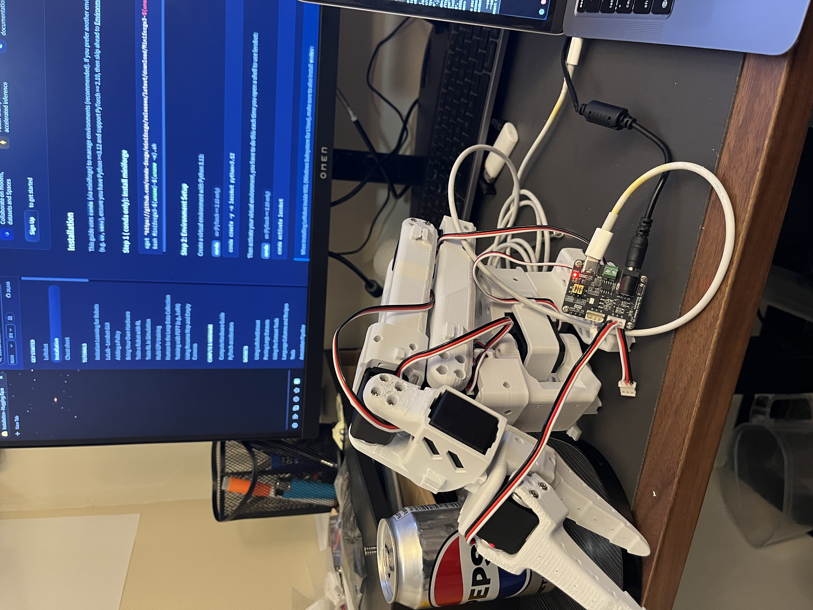
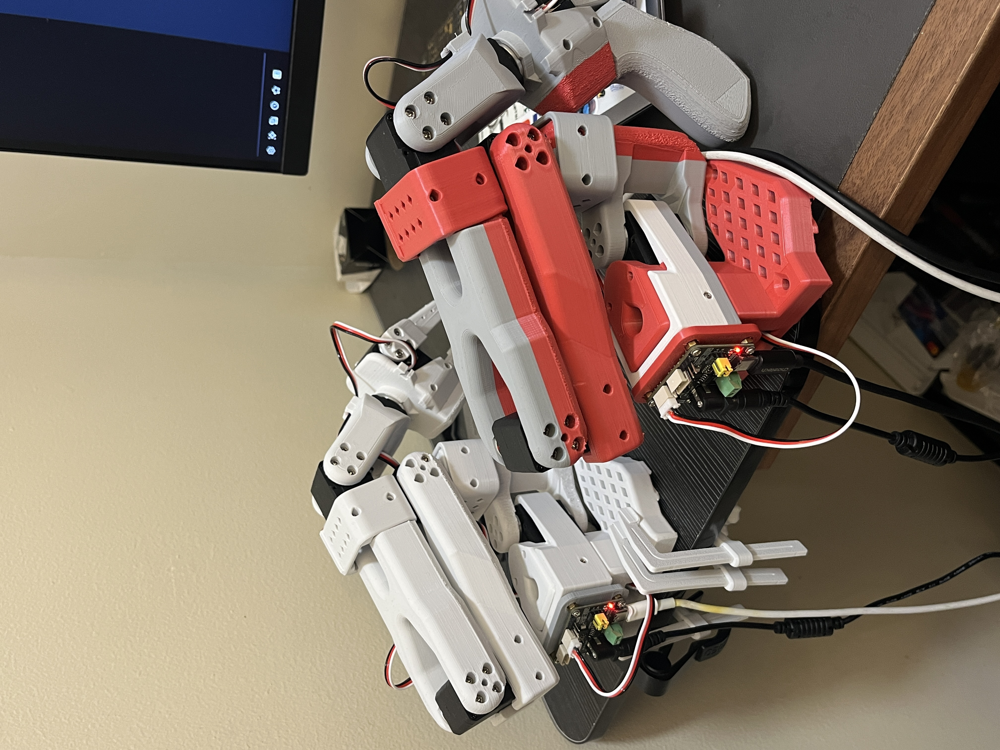
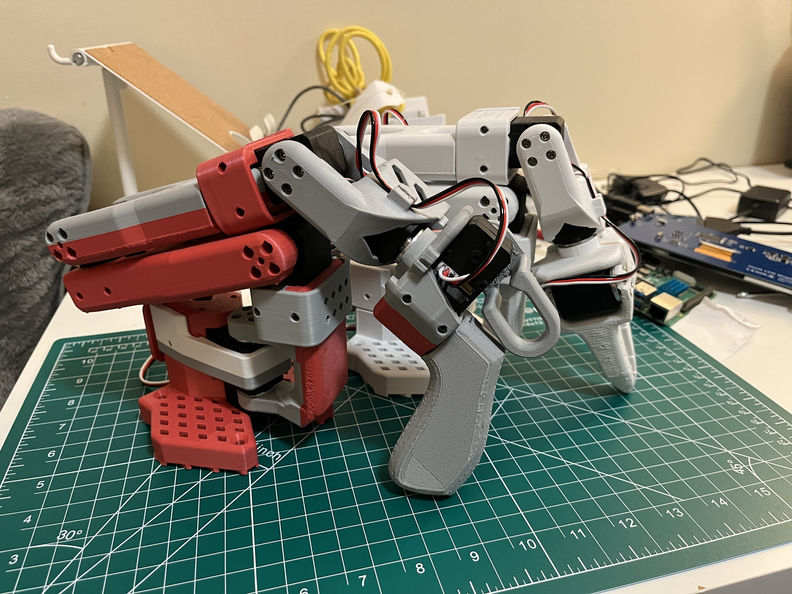

# SO-101 Dual-Arm Robotics & VLA Research Platform

A two-machine research platform for dual-arm manipulation and vision-language-action (VLA) research: a physical SO-101 leader/follower arm pair on macOS, an **NVIDIA Isaac Sim** digital twin and GPU training node on Windows, and a custom real-time bridge connecting them. Full hardware specs, calibration data, and the long-term research roadmap live in [SO101_System_Architecture_Handover.md](SO101_System_Architecture_Handover.md); this README covers current status, architecture, and what's next.

## Hardware build

| | |
|---|---|
|  |  |
| Structural links printed in-house on a Bambu Lab A1 | Partial assembly — Feetech STS3215 servos, wiring harness, motor driver board |
|  |  |
| Joint-level detail: servo horns, cabling, control board | Fully assembled arm, calibrated and ready for teleoperation |

## Architecture

```
                  HIGH-LEVEL AGENTIC PLANNER (VLM/LLM)              [future work]
                                   |
                     MID-LEVEL VLA POLICY (ACT / SmolVLA)           [future work]
                                   |
              COMMUNICATION BRIDGE — ZeroMQ, typed dataclass schema
                       /                                \
     WINDOWS: NVIDIA Isaac Sim                macOS: LeRobot + physical SO-101
     (CUDA-accelerated digital twin,           (PyTorch-based control stack,
      GPU-based domain randomization)           6-DOF dual-arm hardware driver)
```

- **Windows node (this repo)** — NVIDIA Isaac Sim, CUDA-accelerated GPU simulation, the digital-twin and future training environment.
- **macOS node** — LeRobot (PyTorch), driving the real SO-101 leader/follower arms over USB serial, recording teleoperation datasets.
- **Bridge** — a low-latency ZeroMQ link with a typed dataclass message schema streaming joint state between the two machines in real time.

## Status

- [x] Repo scaffolded: `sim/`, `bridge/mac/`, `bridge/windows/`, `scripts/`
- [x] NVIDIA Isaac Sim (v6.0.1, built from source) verified and launched on Windows — GPU compatibility check **passed** (RTX 5070, CUDA driver 610.74, 12.8 GB VRAM)
- [x] ZeroMQ communication bridge implemented: shared `JointState` dataclass schema, Mac-side publisher (reads the LeRobot motor bus), Windows-side subscriber — verified end-to-end with a local test publisher
- [x] Physical SO-101 dual-arm hardware assembled, 3D-printed in-house, and calibrated; leader/follower teleoperation validated via LeRobot
- [ ] SO-101 asset imported into Isaac Sim as a controllable digital twin
- [ ] Live bridge test: real leader-arm motion mirrored in the Isaac Sim twin
- [ ] Domain-randomized synthetic data generation + ACT policy training

## Repository layout

- `sim/` — Isaac Sim scripts: asset import, joint control, scene setup.
- `bridge/joint_state.py` — shared typed message schema (dataclass, binary + JSON codecs) used by both sides of the bridge.
- `bridge/mac/` — communication code that runs on the Mac (reads live arm state via LeRobot's motor bus, publishes it over ZeroMQ). Written here, executed there.
- `bridge/windows/` — communication code that runs here (subscribes to arm state, will drive the Isaac Sim twin).
- `scripts/` — utility and local verification scripts (e.g. a dummy publisher for testing the Windows side without the Mac).
- `media/` — build photos.

## Tech stack

**Simulation & GPU compute:** NVIDIA Isaac Sim, Isaac Lab, CUDA, RTX-class GPU acceleration, USD
**ML / control:** PyTorch, LeRobot, NumPy, planned Action Chunking Transformer (ACT) / SmolVLA policies
**Systems:** Python 3.12, dataclass-typed schemas, ZeroMQ, cross-platform (macOS ⇄ Windows) distributed architecture
**Hardware:** Feetech STS3215 serial-bus servos, custom 3D-printed structural parts (Bambu Lab A1)

## Future work

- **VR teleoperation** — controlling the arm via a VR headset (hand tracking / motion controllers) as an additional, more immersive demonstration-collection modality alongside the leader-arm setup, and as a step toward egocentric-view-based policy learning.
- **Sim-to-real transfer** — domain-randomized rollouts in Isaac Sim (lighting, camera pose, friction, object scale) to train an ACT policy and deploy it zero-shot to the physical arm.
- **Closed-loop agentic manipulation** — a VLM/LLM planner (scene understanding, task decomposition, failure detection and re-planning) sitting above the learned policy.
- **Data harvesting at scale** — streaming teleoperation demonstrations directly into `LeRobotDataset`-format training pipelines.

See [SO101_System_Architecture_Handover.md](SO101_System_Architecture_Handover.md) for full hardware specs, calibration values, and the detailed hierarchical AI architecture this project is working toward.
